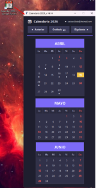
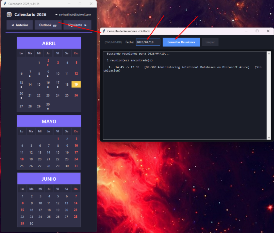

## 📅 Calendario 2026

Aplicación de escritorio desarrollada en Python con días festivos, puedes gestionar agendas y consultar reuniones de Outlook  y Microsoft teams de forma rápida y sencilla.

## 🚀 Características

📆 Consulta de calendario por fecha

📨 Integración con Outlook (reuniones)

⚡ Interfaz simple y fácil de usar

🖥️ Programa ejecutable (.exe) listo para usar

🆓 Totalmente gratuito

Puedes descargar la versión más reciente desde aquí:

## 👉 Descargar última versión
 📦 Descargar

## 🛠️ Cómo usar

Descarga el archivo .zip desde la sección de Releases

Descomprime el archivo

Ejecuta el archivo .exe

Ingresa la fecha en formato:

YYYY/MM/DD

Haz clic en Consultar Reuniones

🧑‍💻 Tecnologías utilizadas

Python

Tkinter (interfaz gráfica)

Integración con Outlook (win32com)

##

📢 Canal de YouTube

Si te interesa el desarrollo de software, aplicaciones gratis y automatización:

👉 Suscríbete a mi canal:

<http://www.youtube.com/@CopyAndPasteFree>

##

📄 Licencia

Este proyecto es de uso libre para fines personales.

✍️ Autor

Carlos Villada

⭐ Apoya el proyecto

Si este proyecto te fue útil:

Dale ⭐ al repositorio

Compártelo

Suscríbete al canal
